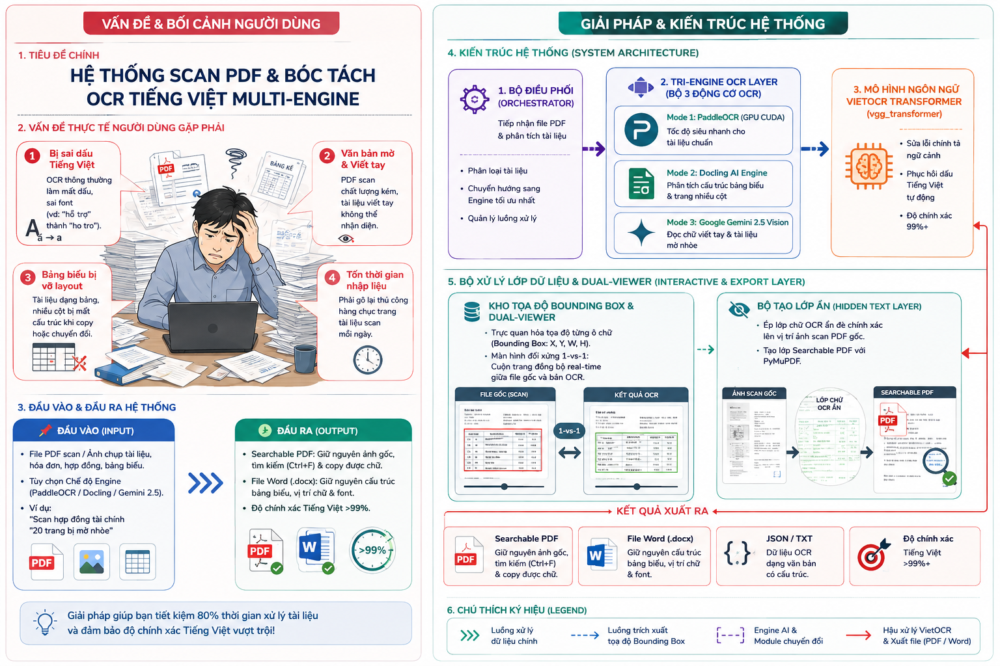
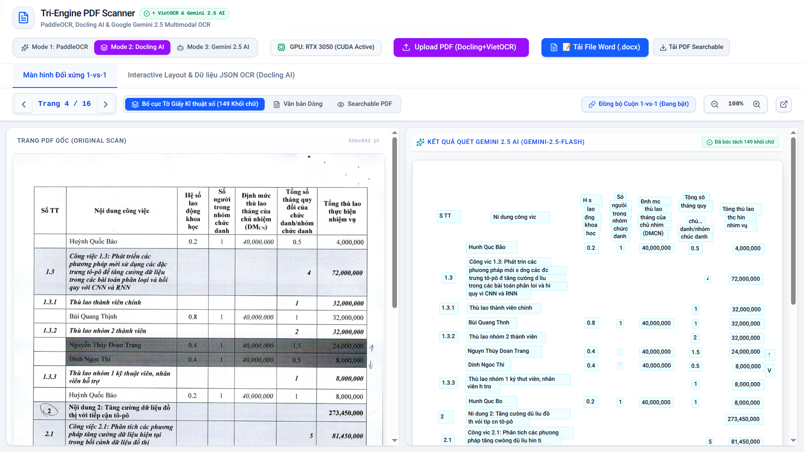
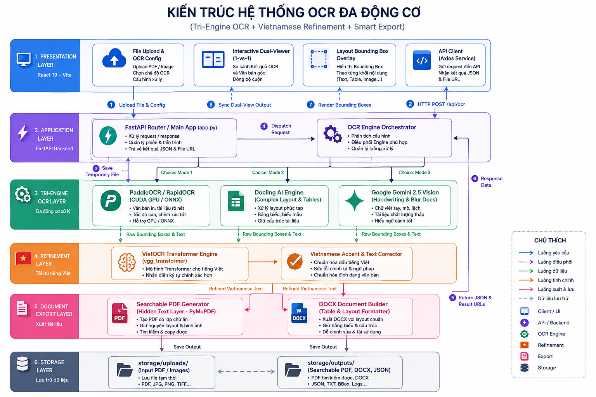

<div align="center">

# 📄 Tri-Engine PDF Scanner & Vietnamese OCR Suite

  <p align="center">
    <b>Giải Pháp Quét OCR Multi-Engine & Bóc Tách Bảng Biểu Tiếng Việt Siêu Chính Xác</b>
    <br />
    <a href="#-tính-năng-nổi-bật"><strong>Khám phá tính năng »</strong></a>
    <br />
    <br />
    
    
    
    
    
    
  </p>

</div>

---



---

## 📸 Demo Giao Diện Ứng Dụng



---

## 🏗️ Kiến Trúc Hệ Thống (System Architecture)



---

## ✨ Tính Năng Nổi Bật

### ⚡ 1. Hỗ Trợ Multi-Engine OCR (Tri-Engine Architecture)
* **Mode 1: PaddleOCR (GPU/CPU Acceleration)**  
  Quét nhanh tốc độ cao, hỗ trợ tăng tốc phần cứng với **NVIDIA CUDA GPU** (RTX/GTX) hoặc tự động fallback CPU.
* **Mode 2: Docling AI Engine**  
  Bóc tách tài liệu phức tạp, phân tích bố cục tờ giấy khoa học, bảng biểu phức tạp và tài liệu nhiều cột.
* **Mode 3: Google Gemini 2.5 Multimodal Vision AI**  
  Ứng dụng sức mạnh từ **Gemini 2.5 Flash / Pro** để đọc văn bản viết tay, bảng biểu tài chính mờ nhòe với độ chính xác tuyệt đối.

### 🇻🇳 2. Tinh Chỉnh Tiếng Việt Tự Động Với VietOCR (99%+ Accuracy)
* Tích hợp mô hình Deep Learning **VietOCR Transformer (`vgg_transformer`)** để hậu xử lý văn bản OCR.
* Khôi phục dấu tiếng Việt chuẩn xác cho các tài liệu scanned chất lượng kém, mờ nhòe hoặc mất nét.

### 🔍 3. Interactive Dual-Viewer (Màn Hình Đối Xứng 1-vs-1)
* **Đồng bộ cuộn trang Real-time**: Xem bản scan PDF gốc và kết quả OCR song song cùng lúc.
* **Layout Bounding Box Interactive**: Trực quan hóa tọa độ từng khối văn bản (Bounding Boxes) đè trực tiếp trên trang PDF.
* **Chế độ kiểm tra chi tiết**: Giúp người dùng so sánh nhanh từng dòng, từng ô bảng biểu giữa ảnh gốc và kết quả số hóa.

### 📥 4. Xuất Báo Cáo & Tài Liệu Chuẩn Định Dạng
* **Xuất file Word (`.docx`)**: Giữ nguyên cấu trúc bảng biểu, vị trí chữ, khoảng cách dòng và font chữ.
* **Tạo file Searchable PDF**: Thêm lớp văn bản ẩn (Hidden OCR Text Layer) tương thích chuẩn ISO, giúp tìm kiếm chữ (Ctrl+F) và copy văn bản ngay trên file PDF gốc.

---

## 🛠️ Công Nghệ Sử Dụng (Tech Stack)

### Backend
* **Framework**: [FastAPI](https://fastapi.tiangolo.com/) (Python 3.10+)
* **OCR Engines**:
  * [PaddleOCR](https://github.com/PaddlePaddle/PaddleOCR) / RapidOCR (ONNX High-Precision)
  * [VietOCR Predictor](https://github.com/pypa/vietocr) (PyTorch VGG-Transformer)
  * [Docling AI Engine](https://github.com/DS4SD/docling)
  * [Google Generative AI SDK](https://pypi.org/project/google-generativeai/) (`gemini-2.5-flash`)
* **PDF Processing**: PyMuPDF (`fitz`), Pillow, Python-Docx
* **Server**: Uvicorn (StatReload & Asynchronous Worker Threads)

### Frontend
* **Core**: [React 19](https://react.dev/), [Vite](https://vitejs.dev/)
* **Styling**: TailwindCSS v4, Glassmorphism UI
* **Icons & Components**: Lucide React
* **API Client**: Axios

---

## 🚀 Hướng Dẫn Cài Đặt & Chạy Dự Án

### Yêu Cầu Tiền Đề
* **Python**: `>= 3.10`
* **Node.js**: `>= 18.0`
* **NVIDIA GPU** *(Tuỳ chọn để tăng tốc GPU với CUDA)*

### 1. Clone Repository
```bash
git clone git@github.com:chinhanxt/OCR_PDF.git
cd OCR_PDF
```

### 2. Khởi Động Backend (FastAPI Server)
```bash
# Di chuyển vào thư mục backend
cd backend

# Cài đặt các thư viện phụ thuộc
pip install -r requirements.txt

# Khởi chạy server FastAPI (Cổng 8000)
python3 -m uvicorn app:app --reload --host 0.0.0.0 --port 8000
```
Backend sẽ lắng nghe tại địa chỉ: `http://localhost:8000`

### 3. Khởi Động Frontend (React Dev Server)
Mở một cửa sổ Terminal mới:
```bash
# Di chuyển vào thư mục frontend
cd frontend

# Cài đặt gói node packages
npm install

# Chạy giao diện Web
npm run dev
```
Frontend sẽ chạy tại địa chỉ: `http://localhost:5173`

---

## 📁 Cấu Trúc Thư Mục Dự Án

```
OCR_PDF/
├── backend/
│   ├── app.py                # FastAPI Main Server & Endpoints
│   ├── ocr_engine.py         # PaddleOCR & RapidOCR Engine Integration
│   ├── vietocr_engine.py     # VietOCR Deep Learning Transformer Refinement
│   ├── docling_builder.py    # Docling Document Layout Parser
│   ├── gemini_builder.py     # Google Gemini Multimodal Vision OCR
│   ├── pdf_builder.py        # PDF & Searchable Layer Generator
│   ├── docx_builder.py       # DOCX Document Builder
│   └── requirements.txt      # Python Dependencies
├── frontend/
│   ├── src/
│   │   ├── App.jsx           # Main App Interface & State
│   │   ├── api.js            # Axios API Gateway Services
│   │   └── components/       # DualViewer, LayoutEditor, Header...
│   ├── package.json          # Frontend Dependencies & Scripts
│   └── vite.config.js        # Vite Configuration
├── storage/                  # Lưu trữ tạm các file upload và kết quả
└── docs/
    └── demo.png              # Ảnh chụp giao diện ứng dụng Demo
```

---

## 📝 Giấy Phép & Đóng Góp (License)

Dự án được phát triển bởi **chinhanxt**.  
Mọi đóng góp (Pull Request), báo lỗi (Issues) đều được hoan nghênh!

---
<div align="center">
  ⭐ Đừng quên tặng 1 sao (Star) trên GitHub nếu dự án hữu ích đối với bạn!
</div>
